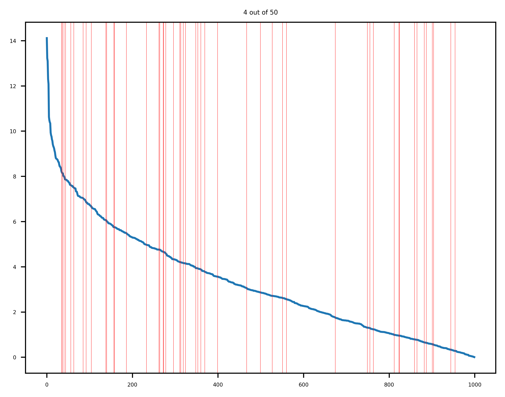

# Quantum Inspired Genomic Prediction

This repository contains quantum-inspired methods for fitting and making predictions using genomic models. The algorithms found in this repository have been developed by the Quantum Application Lab.

The project setup is documented in [project_setup.md](project_setup.md).

## Overview
Genomic prediction is usually modelled using the single nucleotide polymorphism best linear unbiased prediction (SNPBLUP) method. This model combines genomic and pedigree information about a sampled set of animals, and allows one to find the best animals to breed for an objective (e.g., more milk yield for cows, higher egg yield for chickens, etc.). An example paper can be found [here](https://pure.tudelft.nl/ws/portalfiles/portal/89307446/s12711_021_00626_1.pdf). 

This repository uses the algorithms defined in the [quantum-inspired-algorithms](https://github.com/QuantumApplicationLab/quantum-inspired-algorithms) package, to evaluate this model using quantum-inspired methods. 

## Setup

To install genomic_prediction from GitHub repository, do:

```shell
$ git clone git@github.com:QuantumApplicationLab/genomic-prediction.git
$ cd genomic-prediction
$ python -m pip install .
```
or: 
```shell
$ pip install https://github.com/QuantumApplicationLab/genomic-prediction.git
```

Then, one must clone the [quantum-inspired-algorithms](https://github.com/QuantumApplicationLab/quantum-inspired-algorithms) repository and install the package locally or on a virtual environment:

```shell
$ git clone git@github.com:QuantumApplicationLab/quantum-inspired-algorithms.git
$ cd quantum-inspired-algorithms
$ python -m pip install .
```
or:
```shell
$ pip install https://github.com/QuantumApplicationLab/quantum-inspired-algorithms.git
```

## Quantum Inspired Method

The quantum-inspired method has been based on:
- https://github.com/XanaduAI/quantum-inspired-algorithms
- "Quantum-inspired algorithms in practice", by Juan Miguel Arrazola, Alain Delgado, Bhaskar Roy Bardhan, and Seth Lloyd. 2020-08-13, volume 4, page 307. Quantum 4, 307 (2020).
- "Quantum-inspired low-rank stochastic regression with logarithmic dependence on the dimension", by András Gilyén, Seth Lloyd, Ewin Tang. (2018). ArXiv, abs/1811.04909.

The algorithm follows the following form:
1. Approximate SVD using FKV or HALKO (following https://arxiv.org/pdf/0909.4061).
2. Estimate the coefficients using Monte Carlo methods.
3. Sample the solution vector.

## Examples

This repository contains quantum-inspired experiments in `test/test_quantum_inspired_small.py`. An example experiment is seen in `test_qi_no_X` where the quantum-inspired method is used to estimate the best breeding values without fixed effects. 

Running,
```shell
$ python test/est_quantum_inspired_small.py
```
generates visualizations of the animals predicted to be among the top fifty for breeding values using Halko's method. Below is an example of when 1000 Monte Carlo iterations are used. Only the top 4 animals are selected out of the top 50.

However, when 100000 Monte Carlo iterations are used, 15 animals are selected out of the top 50. 


## Contributing

If you want to contribute to the development of genomic_prediction,
have a look at the [contribution guidelines](CONTRIBUTING.md).

